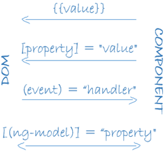

# Single Page Applications with Angular 
### Notes

Telerik Academy course, August 2017

[videos playlist](https://www.youtube.com/playlist?list=PLF4lVL1sPDSlIH8I6T_K_z5kRAf6JI8Ys)

| Vid |                   Topic                    |  Date  | C | V |
| --- | ------------------------------------------ | ------ | - | - |
| 1.  | [Intro](#course-intro)                     | 14.Aug | + | + |
| 2.  | [TypeScript](#typescript-fundamentals)     | 14.Aug | + | + |
| 3.  | [TS OOP](#typescript-oop)                  | 14.Aug | + | + |
| 4.  | [Tools](#angular-tools)                    | 16.Aug | + | + |
| 5.  | [Setup](#setup-and-architecture)           | 16.Aug | ^ | + |
| 6.  | [Components](#components-and-templates)    | 16.Aug | ^ | + |
| 7.  | [CLI](#angular-cli)                        | 18.Aug | + | + |
| 8.  | [Data Binding](#data-binding)              | 18.Aug | + | + |
| 9.  | Demo: [basic app](#demo-app)               | 18.Aug | + | + |
| 10. | [Communication](#components-communication) | 22.Aug | + | + |
| 11. | [Lifecycle](#lifecycle)                    | 22.Aug | + | + |
| 12. | [Modules](#modules)                        | 24.Aug | + | + |
| 13. | [Router](#router)                          | 24.Aug | + | + |
| 14. | [Services and DI](#services-and-di)        | 29.Aug | + | . |
| 15. | [Pipes, Directives, Forms](#pdf)           | 31.Aug | + |   |
|     | Observables?                               |        |   |   |

- `*` - missed &emsp; `^` - no listen &ensp; 
- `0` - video not in playlist &emsp; `.` - no video  &emsp; `--` - no lecture

## Course intro
 14.August.2017 Steven [video](https://youtu.be/IrZrdxUVS0I)

 1. #### Program  
    - Components - single responsibility!
    - Modules - lazy loading
    - Observables - async programming, observables are generics
    - Service layer - will be elaborated in MVC/Android course
 2. #### Evaluation 
    - Course project - 85%
    - Attendance - 10%
    - Helping others - 5%
 3. #### Team project
    - Random teams
    - Quality more important than quantity
    - Can use back-end as a service (eg. Firebase) or own server
    - Integration & UT tests (must be adequate!)
    - Bootstrap, materialise, other.
    - TSlint - no errors
    - Module loaders - SystemJS, WebPack
    - No points to projects which do not compile or don't produce an adequate result
    - Adequate commit logs in GitHub
    - Documentation - description of the project, how to use, 

    Bonus:
    - Use branches in github (git flow - master, dev, features)
    - Project management - GitHub, Trello, ZenHub
    - Cloud hosting (AWS)

    Defence:
    - Each team member will present the project separately - project, source code, architecture, commit logs, other conceptual technological questions.

 4. #### Resources
    - VS Code exclusively
    - Other editors/IDEs are possible but lack some TypeScript features
 .
## TypeScript Fundamentals
 14.August.2017 Steven [video](https://youtu.be/qFKQY2JIK-g)

 1. #### TypeScript Overview

    = **Superset dialect of ECMAScript** (one of many). Created by Microsoft. Has optional static typing. Inherits concepts from C# but has some differences on the use of interfaces and classes. Can use type definitions for intellisense. Can use JavaScript libraries. **Compiles to JavaScript**, not translate or transpile. That is why although Angular is a client-side technology (works on the browser), TypeScript can be used with it. Target JS can be selected during compilation (WebPack takes care for polyfills).
    
    Dialect because has no separate runtime, JavaScript runtime = Node.js > V8, C# runtime = .NET execution strategy. Superset because uses a specification (ECMAScript) and adds to it - variables, classes, interfaces, type definitions, compile time strategies.

    1. Benefits over JS:
        - Static typing (optional) -> more **predictable**
        - Modules, namespaces and stronger OOP -> **scales better** for larger apps 
        - Compilation step -> some **errors are caught at compile-time** instead of at run-time
        - `strictNullChecks` optional parameter to disallow null values
        - Access modifiers (public, private)

    1. #### TS Installation    
        `> npm i -g typescript` - installs **Type Script Compiler**     
        `> tsc -v` - check if the compiler has been installed     
        `> tsc --help` - get help      

    1. **Compiling**    
        Typescript is written in .ts files, which can't be used directly in the browser. They need to be translated to vanilla .js. Compiling can be done through:
        - Terminal `> tsc main.ts` (where main.ts is the name of the file to be compiled) - creates (in the same folder, can be changed) a .js file which can be executed (`> node main.js`)
        - Visual Studio or another IDE
        - Automated task runners such as gulp

 2. #### TS Environment Setup
 
    1. VS Code - a tool developed by Microsoft for TypeScript and .NET Core development. Prerequisites  
    (see [Angular tools](#vs-code-tools)):
        - Configure files: tscofig.json, launch.json, tasks.json
        - Have globally installed **typescript** and **tslint**
        - VS Code Extensions for TypeScript:    
        [TSLint](https://github.com/palantir/tslint),   
        [Typings auto installer](https://github.com/jvitor83/typings-autoinstaller) - intellisense,     
        [Auto Import](https://github.com/soates/Auto-Import) - `Ctrl + .`,  
        [Debugger for Chrome](https://github.com/Microsoft/vscode-chrome-debug)

    1. ### TS tsconfig.json

        (See [Angular TypeScript config](#typescript-config))   
        Specifies the way .ts files are compiled.   
        Auto generate with **`> tsc --init`** but adds too many other options

         ```json
        {
            "compilerOptions": {
                "target": "es5", // Sets the output JS's version
                "module": "commonjs", // Sets the module loader
                "outDir": "dist", // Sets output JS files' location
                "sourceMap": true, /* Generates *.js.map file, 
                to convert js to ts and enable debugging of ts in VSCode */
                "noEmitOnError": true /* Do not compile if errors, stop. 
                Default is to attempt to compile regardless of errors. */
            }
        }
        ```

        Module loaders - Node.js uses the default module loader, which implements the CommonJS convention. Other - AMD, SystemJS. Angular supports both SystemJS, and WebPack bundler.

        Dist folder (distribution) is a convention used in many libraries.

    1. ### launch.json

        Specifies the way VS Code should launch the application.    
        Auto generate with VS Code (`F5` or `Ctrl + F5`) - creates file in .vscode folder (which also can hold tasks file, other workspace files with our own configurations of the editor).

         ```json
        {
            "configurations": [
                {
                "type": "node",
                "request": "launch",
                "name": "Launch Program",
                "program": "${workspaceRoot}/dist/index.js",
                "preLaunchTask": "compile",
                "sourceMaps": true,
                "outFiles": [ "${workspaceRoot}/dist/*.js" ]
                }
            ]
        }
        ```
        
        preLaunchTask needs to be defined in the tasks.json file. Have to compile ts to js to be able to run. 

    1. ### tasks.json

        Specifies the way VS Code should run tasks.     
        Auto generate with VS Code.

         ```json
        {
            "version": "2.0.0",
            "tasks": [
                {
                "taskName": "compile",
                "command": "tsc",
                "type": "shell"
                }
            ]
        }
        ```

    1. Running the code and debug
        - Run `Ctrl + F5`
        - Debug `F5`
        - Debug windows: local variables, watch list, call stack, breakpoints (can be line or column, have settings like in Visual Studio)

 3. #### Static Typing

    = Can declare types of variables (sometimes is overhead, use inferring). The compiler makes sure they are assigned values of the specified type. If the type declaration is omitted, the compiler will **infer** it from the code. Similar to C#, there are **basic types** (predefined in the language) and **complex types** (created by the developer).

     ```ts
    let firstName: string = "Pesho";
    let age: number = 20;

    let firstSentence: string = `My name is ${firstName}.`;
    let lastSentence: string = `I am ${age} years old.`;

    function printTwoSentences(one: string, two: string) {
    console.log(`${one} ${two}`); // interpolation string
    }

    printTwoSentences(firstSentence, lastSentence);
    // My name is  Pesho. I am 20 years old.
    ```

 4. #### Basic Types
    1. **Numbers** - as in JavaScript, all numbers int TypeScript are **floating point values**. The language is **type-safe** - once set/inferred, the type cannot be changed (if not type `any`).

         ```js
        let floatNum = 10.5;
        floatNum = "Pesho"; // will not compile
        ```

        Samples

         ```ts
        let decimal: number = 6;
        let hex: number = 0xf00d;
        let binary: number = 0b1010;
        let octal: number = 0o744;
        ```

    1. **Strings** - double quotes ("), single quotes ('), backtick (`) template/interpolation strings to span multiple lines and embed expressions/variables.

    1. **Arrays**

        Basic type: `let list: number[] = [1, 2, 3];`

        Complex generic type Array (not inferred): `let list: Array<number> = [1, 2, 3];`
    
    1. **Boolean** - hold true or false value
    1. **Enums** - a way to give user-friendly names to sets of numeric values. Default numbering starts from 0. Numeric values can be manually set. Can log/get the value or the name of the enum.

         ```ts
        enum Color {Red = 1, Green, Blue}
        let c: Color = Color.Green;

        let colorNumber: number = Color.Green;
        console.log(colorNumber); // 2

        let colorName: string = Color[1]; 
        console.log(colorName); // Red
        ```

    1. Null and undefined - same as in JavaScript, not very useful on their own. They are subtypes of all other types (i.e. can be assigned to any type). If **`strictNullChecks`** flag is used during compilation null number will not compile.

         ```ts
        let u: undefined = undefined;
        let n: null = null;
        let num: number = null; // won't compile if strictNullChecks
        ```

 5. #### Other Basic Types
    1. Any - used to disable type-checking for a given variable or function, use when  not sure of the type or when a variable comes from an external library. Can be used on arrays. **Bad practice**, avoid using. 

         ```ts
        let notSure: any = 4;
        notSure = "maybe a string instead";
        notSure = false; // okay, definitely a boolean

        let list: any[] = [1, true, "Pesho"];
        ```

    1. Unions - type that combines two+ types, can be used on arrays. Rarely used - somewhat **bad practice**. Used in tuple.

         ```ts
        let example: (number | string);
        example = "Pesho"; /* OK */
        example = true; /* Error */
        example = 10; /* OK */

        let list: (number | string)[] = [1, 2, "Pesho"];
        ```

    1. Tuple - express an array where the type of a fixed number of elements is known, but their values might be different. Not often used, not clear, bad practice.

         ```ts
        /* Declare a tuple type */
        let x: [string, number];

        /* Initialize it */
        x = ["hello", 10]; // OK

        /* Initialize it incorrectly */
        x = [10, "hello"]; // Error
        ```

    1. Indexing 
        - when accessing an element with known index, the correct type is retrieved

         ```ts
        console.log(x[0].subStr(1)); /* OK */
        console.log(x[1].subStr(1)); /* Error, 'number' does not have 'substr' */
        ```

        - when accessing an element outside the set of known indices, a union type is used instead.

         ```ts
        x[2] = "world"; /* OK, 'string' can be assigned to 'string | number' */
        console.log(x[3].toString()); /* OK, 'string' and 'number' both have 'toString' */
        x[4] = true; /* Error, 'boolean' isn't 'string | number' */
        ```

 6. #### Functions
    
    1. Both standard and arrow functions are valid.

        Allows to constrain input parameters and specify a return type. Return type can be a basic type or complex type, and can be inferred from the code. 

         ```js
        function add(x: number, y: number): number {
            return x + y;
        }
        ```

    1. **Return types**

        Two additional basic types used mainly as return types for functions :
        - `void` - used to indicate that the function returns nothing, **basic** type, opposite of `any`, technically could be assigned to a var, a void var can be only undefined or null) 

         ```ts
        let unusable: void;
        unusable = undefined; /* OK */
        unusable = null; /* OK */
        unusable = 1; // Error
        ```

        - `never` - **basic** type, represents the type of values that never occur, used for functions that always throw an error or never return. Not used often.

    1. **Parameters**

        By default, TypeScript assumes that every parameter is **required**. The compiler checks if all parameters are passed. Still can pass null or undefined (depends on the strictNullChecks flag), avoid it. Better use default or optional parameters `lastName = "Smith"`.

         ```js
        function buildName(firstName: string, lastName: string = "Smith") {
            return firstName + " " + lastName;
        }
        /* no default param set */
        let result1 = buildName("Bob");                  /* error, too few parameters */
        let result2 = buildName("Bob", "Adams", "Sr.");  /* error, too many parameters */
        let result3 = buildName("Bob", "Adams");         /* OK */
        let result4 = buildName("Bob", null);            /* works, returns "Bob null" */
        /* with default parameter */
        let result2 = buildName("Bob", undefined);       /* works, also returns "Bob Smith" */
        ```

        Optional parameters are possible with `?`, must always be last `function buildName(firstName: string, lastName?: string)`

        **Rest parameters** are possible with ellipsis (...) (similar to `arguments` global variable in JS but better because it's not a global var, global variables are difficult to unit test) 

         ```js
        function buildName(firstName: string, ...restOfName: string[]) {
            return firstName + " " + restOfName.join(" ");
        }

        let employeeName = buildName("Joseph", "Samuel", "Lucas", "MacKinzie");
        ```

        Ellipsis can be used in function definition.

         ```js
        function buildName(firstName: string, ...restOfName: string[]) {
            return firstName + " " + restOfName.join(" ");
        }

        let buildNameFun: (firstName: string, ...rest: string[]) => string;
        buildNameFun = buildName;
        ```

        When using Angular often types are inferred, only when creating interfaces and defining classes. **Return types** are more often used.
 .
## TypeScript OOP
 14.August.2017 Steven [video](https://youtu.be/nBGMoerF16c)

 There is a difference between modules in TypeScript (same as in JS) and in Angular (collection of components and services).

 1. #### Classes

    Allow defining complex types.
    Inheritance - `extends`, `this`, `super`. Variables and methods can be overridden - use `super` (instead of `this`) to call the base method to prevent recursion (same as in JavaScript).

    Can use polymorphism (real, not the default as in JS - everything inherits object??)

 2. #### Accessors - getter, setter

    Allow control of data state of the class by implementing **validations** (comes from ECMAScript standard)

 3. #### Static members

    Can be accessed through the type itself, no need to create an instance (prefix is the name of the class, not `this`). Hold values needed for the whole type in general, not for specific instances (ie `Math.sqrt()`) (comes from ECMAScript standard)

 4. #### Abstract Classes
    
    Base class from which other classes can be derived. **Cannot be instantiated directly**. Use - situations in which the base class is an abstraction, not a real object. Used for default configurations. Not so easy in JS.     
    `abstract class Animal { }`

 5. #### Access Modifiers

    Restrict access to methods, fields, functions and constructors. (no internal as in C# because modules are not namespaces):
    - **Public** - **default** (if not specified). Class member is accessible from anywhere. 
    - **Private** - accessible only within the class in which it is defined. Allows use of encapsulation -> improved readability. `class Animal { private name: string; }`
    - **Protected** - accessible within the current class and the class' children. Can be changed to public in children (not a good practice).
    - **Readonly properties** - must be initialised in their declaration or in constructor. Can hold external services. In the context of dependency injection, it is important injected properties/objects to be readonly.    
    - **Constructor shorthand** - use regular access modifiers and getter/setters to validate data.**Important to validate all incoming data!** -> maintainability, scalability.

         ```ts
        class Animal {
            constructor(private name: string) { } /* instead of declaring a field */
        }
        let cat: Animal = new Animal("Cat"); 
        console.log(cat.name) // Error: 'name' is private;
        ```

 6. #### Interfaces

    Just like classes but do not implement functionality & cannot be instantiated (like in C# but names don't start with 'I'). Can be **used as constraints**. Classes implementing an interface must provide the implementation details.

     ```ts
    interface SquareConfig {
        color?: string;
        width?: number;
    }

    let mySquare = createSquare({color: "black"});

    function createSquare(config: SquareConfig): { color: string; area: number } {
        let newSquare = {color: "white", area: 100}; /* Default values*/
        if (config.color) { /* if passed object has this property. 
        Check needed if the property is optional '?', 
        otherwise passing the object will give error?? */
            /* Error: Property 'color' does not exist on type 'SquareConfig' */
            newSquare.color = config.clor;
        }
        if (config.width) {
            newSquare.area = config.width * config.width;
        }
        return newSquare;
    }
    ```

    Above example not much high-quality code - creates an object inside. It would be better to receive a default values as parameter, but then it would need to be a class, because interfaces have no implementation.

    > Good practice: all interfaces in one file eg. 'data.models.ts'

    Inside an interface you can also define:
    - Indexers (index type and return type) (like in C#, not often used)
    - Function types/signature    
    `speak: () => string` name, parameters, return type or  
    `(source: string, subString: string): boolean;` parameters, return type

    ```ts
    interface SearchFunc {
        (source: string, subString: string): boolean;
    }

    let search: SearchFunc; /* ?? */
    let pesho = (source: string, subString: string) => { return true; }
    search = pesho;
    ```

 7. #### Generics

    Adding flexibility to object/function templates. Generics allow to create a class or function which works with a variety of types rather than a single one. Can accept multiple types eg. `<T, N>`

     ```ts
    function identity<T>(arg: T): T {
        return arg;
    }
    console.log(identity<string>("Pesho")) /* works with string. Prints Pesho */
    console.log(identity(new Person("Pesho")) /* works with Person. Type is inferred */
    ```

    Generic factory (like in C# `pesho<T>(pesho) where T: Person`)

     ```ts
    abstract class Animal { numLegs: number; }
    class Bee extends Animal { keeper: BeeKeeper; }
    class Lion extends Animal { keeper: ZooKeeper; }

    function createInstance<A extends Animal>(c: new () => A): A {
        return new c();
    }

    createInstance(Lion).keeper.nametag;  /* type checks! */
    createInstance(Bee).keeper.hasMask;   /* type checks! */
    ```

 8. #### TS Modules

    Executed within their own scope, not in the global scope. Variables, functions, classes, etc. declared within a module are not visible outside the module. `import`, `export`. Change of name at export is not a good practice but changing the name at import is useful because of possible conflicts. 

    Importing the whole module `import * as validator from "./ZipCodeValidator"` is not a good practice - **creates global variable**. Better ` import { ZipCodeValidator } from "./ZipCodeValidator";`

    **Export wrapping** - can wrap exports from multiple files into a single file called **barrel** file.

     ```ts
    /* index.ts file */
    export * from "./stringValidator"; /* exports interface 'StringValidator' */
    export * from "./zipCodeValidator";  /* exports class 'ZipCodeValidator' */
    ```
 .
## Angular Tools
 16.August.2017 Martin [video](https://youtu.be/UwJfAWhoq9k)

 1. #### IDEs
    - VS Code - not an IDE but with all the extensions, comes close
    - WebStorm - JavaScript oriented
    - IntelliJ IDEA - Java oriented

 2. #### VS Code Tools
    See [Environment set up](#ts-environment-setup)
    - Quick set up **demo app with CLI** (more details in lecture [Angular CLI](#angular-cli)).
        - `> ng new ng-demo` - scaffolds a working project, does npm install. Different **seeds**?? (Minko Gechev) - better control over WebPack than in CLI. 
        - **WebPack** module bundler (similar to module loader SystemJS) - takes js, css all files and makes them into chunks files. 
        - `> ng serve -o` serves at port 4200. 
        - `index.html` is created empty with tag `<app-root>` (component which Angular bootstraps for us, everything happens in it).
        - `app` folder holds all Angular components and files (when creating from CLI)
        - `app.component.ts` file defines '@Component' with selector for the app-root tag from index.html and inserts/renders contents into app.component.html template

    - **Angular Language Service** - [link](https://github.com/angular/vscode-ng-language-service) - provides auto complete for data binding - from component.ts exports to component.html template file (like pug templates) (if it doesn't load suggestions, exclude node_modules in VSCode workspace settings **Ctrl+,** `files.exclude: {"**/node_modules": true}`)

    - **TSLint** - [link](https://github.com/Microsoft/vscode-tslint) - integrates lint in VSCode, dynamic error notifications, otherwise have to run lint from cmd each time a change is made. Supports automatic fixing of errors - CLI creates tslint.json file, rules are in 'node_modules/codelyzer' (by Minko Gechev too)
    - **Angular Snippets** - 
    [BeastCode](https://github.com/BeastCode/VSCode-Angular-TypeScript-Snippets), 
    [johnpapa](https://github.com/johnpapa/vscode-angular-snippets)
    
    - #### **Angular Files**

        [GitHub](https://github.com/qwert789/vscode-angular2-files) - scaffolds files from templates - eg. component has css, html, spec.ts, ts files, can use this extension to generate all of them (based on CLI see [#blueprints](#blueprints)) (eg. right click on app folder - `Generate Component`)

         ```js
        /*.angular-cli.json file specifies component generation settings*/
        "defaults": {
            "styleExt": "css",
            "component": {
                "spec": true, /* will create spec file with some tests */
                "inlineStyle": false, /* will create css in a separate file*/
                "inlineTemplate": false, /* will create html template in separate file */
                "flat": false /* will create new folder */
            },
        ```

         ```ts
        /* app.component.ts file if most settings set to true - separate files*/
        import { Component } from '@angular/core';
        @Component({
            selector: 'app-root',
            templateUrl: './app.component.html',
            styleUrls: ['./app.component.css']
        })
        export class AppComponent {
            person = { firstName: 'Martin' };
        }
        ```
         ```ts
        /* my.component.ts if all settings above set to false - all in one file*/
        import { Component, OnInit} from '@angular/core';
        @Component({
            selector: 'app-my',
            template: `
            <p> my Works</p>
            `,
            styles: []
        })
        export class MyComponent implements OnInit {
            constructor () { }
            ngOnInit() { }
        }
        ```

    - **TypeLens** - [link](https://github.com/kisstkondoros/typelens) - reference counter

    - **Types Auto Installer** - [link](https://github.com/jvitor83/typings-autoinstaller) - downloads type-files (interfaces) automatically on libraries installation -> intellisense

    - /Angular Switcher - [link](https://github.com/infinity1207/angular2-switcher) - move between html css ts files with `Alt+U` `Alt+O`

    - **Auto Import** - [link](https://github.com/soates/Auto-Import) - for importing modules

    - **Path Intellisense** - [link](https://github.com/ChristianKohler/PathIntellisense)

    - Settings sync Shan Khan - synchronise settings between many computers

 3. #### Angular-specific tools
    - **Angular CLI** - [link](https://cli.angular.io/)   
    `ng new`  
    Generating new component with CLI:    
    `ng g c new1 --spec false --flat false -d` (ng = engine?, g = generate, c = component, -d = dry run - no changes will be written??)

    - **Augury** - [link](https://augury.angular.io/) - useful for debugging, developed by Angular(Google), Google Chrome extension, provides additional information in Chrome Developer Tools (F12) in Augury tab- debug directly JS, router tree, modules (BrowserModule needed to specify which platform to work with??), `Ctrl + P` search files

    - **Codelyzer** - [link](http://codelyzer.com/) by Minko Gechev - set of tslint rules for static code analysis of Angular ts projects (supported by Angular CLI)

    - **Compodoc** - [link](https://compodoc.github.io/website/), [demo](https://compodoc.github.io/compodoc-demo-todomvc-angular/) - builds component documentation
    
    - **Angular Material** - [link](https://material.angular.io/), [intro](https://material.io/guidelines/material-design/introduction.html) - material components.     
    Other components resources: [Angular website resources](https://angular.io/resources), [GitHub list of components](https://github.com/brillout/awesome-angular-components)

 .
## Setup and Architecture
 16.August.2017 Martin [video](https://youtu.be/6rpforFlmsA), [video Angular4 in 60 min](https://youtu.be/KhzGSHNhnbI)

 1. #### What is Angular 
    [website](https://angular.io/guide/quickstart)  

    = Front-end/client-side JavaScript **framework** (runs on client). Open-source JavaScript framework for creating single-page applications (SPA). Created by Google. Provides application architecture (MVC), routing, templates, server-communication (http), etc. Something like a bundle of jQuery + Handlebars + Sammy.js with consistent APIs. Can be used with both JS and TypeScript (recommended by Google). Cross platform (Windows, Mac, Linux). Similar to React, VueJS.
    
    Parts of the SPA app are split into components. The main content is loaded in `<app-root>` tag.

    The page never changes (sort of) - contains one html file and bundles of JavaScript files. Every change is rendered in the browser (client side??).

    Fast and reactive - allows to get only the changed data from the server instead of the whole page .

 2. #### Building blocks

    1. #### **Modules** intro

        > See [Modules lecture](#modules)

        A mechanism to group components, directives, pipes and services that are related. Great way to organise an application and extend it with capabilities from external libraries. Wraps functionality. Something like a namespace. Allows reuse of code. Many of the libraries coming with Angular are modules (FormsModule, HttpModule). Angular modules (`@NgModule`) are different from JavaScript modules. 

        AppModule - root of the application. The only module which is bootstrapped by our Angular application.

        #### @NgModule metadata

        Tells Angular how to compile and run the module code; identifies the module's own components, directives and pipes; may add service providers to the application dependency injectors. 

        - declarations - contain components, directives, pipes which you want to use in the module
        - imports - modules (need to be imported on top)
        - providers - services
        - bootstrap - only in the main module, identifies which component to be bootstrapped in the main.ts file
        - exports - DI if we want to expose a component which was imported??
         ```ts
        /* app.module.ts 
        imports here  */
        @NgModule({
        declarations: [
            AppComponent,
            MyComponent
        ],
        imports: [ BrowserModule, ],
        providers: [ MyService ], /*Instantiates classes, shorthand for 
        {provide: MyService, useClass: Pesho}*/
        bootstrap: [AppComponent],
        exports: [ MyComponent ]
        })
        export class AppModule { }
        ```

        #### JIT     
        Just in time compilation of an Angular application

         ```ts
         /* main.ts file */
        import { platformBrowserDynamic } 
        from '@angular/platform-browser-dynamic';

        import { AppModule } from './app/app.module';

        platformBrowserDynamic().bootstrapModule(AppModule);
        ```

    1. #### Components overview

        (See [Components lecture](#components))
        The main building block of an application. The component (decorated class) controls a patch of screen called a view. Each component is associated with a view (HTML template). The class/component interacts with the view through an API of properties and methods.

        Sample component which will be used in another component's template with the selector `<app-main></app-main>` (must be unique).

        Components encapsulation of styles - css - can manipulate globally and have individual styles to each component. Prevents filling the global scope with styles.

         ```ts
        import { Component } from '@angular/core';

        @Component({
        selector: 'app-main',
        template: `<div>Hello {{title}}!</div>`
        })
        export class MyComponent {
        title: string;
        constructor() { this.title = 'World'; }
        }
        ```

    1. #### Templates overview

        (See [Templates lecture](#templates))     
        A form of HTML that tells Angular how to render the component. Constructed from HTML elements and Angular-specific directives, components, bindings. Additional elements:     
        `*ngFor` - directive for loop    
        `{{post.title}}` - bind component properties    
        `<demo-app></demo-app>` - special selector  

         ```ts
        @Component({
        selector: 'app-main',
        template: `<div>
        <h1>{{title}}</h1> /* bind to the title from the component */
        <li *ngFor="let book of books"> /* directive for a loop */
        {{book.title}}
        </li> 
        </div>`
        })
        ```


    1. **Metadata**

        Used to decorate a class/component and to tell Angular how to process it and what to search for in the component. Passed using a decorator (uses @ sign, different for `@NgModule`, `@Component`, `@Directive` etc.). 
        
        Decorator pattern - decorates a class with functionality it doesn't originally have. This way, Angular knows that this is not a regular ts file/class and can understand it.

        **Template + metadata + component = view**

         ```ts
        @Component({
            selector: 'demo-app',
            /* templateUrl: 'path-to-file' */
            template: `<div>Demo app</div>`,
            providers: [Services],
            styleUrls: ['path-1', 'path-2']
        })
        ```

    1. **Data binding**

        The ability to transfer data from a component to the html/.

        Forms:
        From component to DOM
        - `{{value}}`
        - `[property] = "value"`    

        From DOM to component
        - `(event) = "handler"`

        Bi-directional
        - `[(ng-model)] = "property"`

    1. **Directives**

        = A component without a template/html. Angular templates are dynamic so the framework transforms the DOM according to the instructions from the directives (`*ngFor`, `*ngIf`, `[(ngModel)]`). `@Component` decorator is an extended `@Directive` decorator (a template is added).

        CommonModule (BrowserModule exports it so it doesn't have to be specifically imported) - holds directives `*ngFor`, `*ngIf` etc.

        (Read more [Structural directives](https://angular.io/guide/structural-directives))

    1. **Services**

        Could be almost any class with a **well-defined, single purpose**. Nothing special for services in Angular. They serve to move responsibility for doing something special from the components. Eg.:
        - a component should not log to the console itself - this could be a global service, or    
        - if using Toastr as a service - it will have only one instance,   
        - if using login functionality - we want to have only one instance, 
        - if it makes get request to a certain route.

        A service is a pure TypeScript class. Can be used in many places in the application. **Scalable** and **reusable**.

        Eg. service which only informs the user:

        ```ts
        export class LoggerService{
            info: void(msg: string) {
                console.log(`INFO: {msg}`);
            }
            error: void(msg: string) {
                alert(`ERROR: {msg}`);
            }
        }
        ```

        Generating a service:
        - `> ng g s shared/logging -d --flat --spec false` - generate service, dry run (first to test, then run without it), no folder, no spec file.  
        - Add service to app.component.ts metadata `@Component({providers: [LoggingService]})` would create a new instance for each component it is added to.    
        - Instead, add it to the **app.module.ts** `@NgModule({providers: [LoggingService]})` - this way the whole application will have only one logging service
        - Inject the service in the constructor of the component where we want to use it: **app.component.ts** `constructor(private loggingService: LoggingService)`

    1. **Dependency injection**

        DI is a pattern which allows us to manage code dependencies; to inject dependencies in different components across the application. Abstracts the responsibility of knowing how those dependencies are created or what dependencies they themselves need. Eg. `constructor(private service: HeroService) { }`. 
        
        Pass dependencies in the constructor as parameters instead of instantiating them inside. Compose objects instead of deep inheritance hierarchies.

        Angular has its own DI system, which resolves all dependencies but the developer also has control over them. No need to add external libraries.

    1. **Folder structure**

        Sample file structure: [mGechev angular-seed](https://github.com/mgechev/angular-seed), [Angular style guide](https://angular.io/guide/styleguide#!#04-06)      
        Angular CLI scaffolds a good file structure as a starting point.
        
        ```
        project root/
        app/
            heroes/
                hero/
                    hero.component.ts
                    index.ts
                heroes.module.ts
                heroes-routing.module.ts
            app.component.ts
            app.module.ts
        main.ts
        index.html
        assets/ - holds photos
        environments/
        ```

 3. #### Setup a project

    1. **Prerequisites** 
        - Installed Node.js and npm
        - TypeScript (See [TS Installation](#ts-installation))
        - IDE- Visual Studio Code preferably
        - Angular CLI, Angular Seed (optional starter project) by [Minko Gechev](https://github.com/mgechev/angular-seed) or QuickStart Seed - boilerplate starting application. [Tutorial](https://angular.io/tutorial) - clone Angular QuickStart application from [github](https://github.com/angular/quickstart)

    1. #### TypeScript config 
        (See [TS tsconfig](#ts-tsconfigjson))

         ```ts
        {
            {
            "compilerOptions": {
                "target": "es5",
                "module": "commonjs",
                "moduleResolution": "node",
                "sourceMap": true,
                "emitDecoratorMetadata": true,
                "experimentalDecorators": true,
                "lib": [ "es2015", "dom" ],
                "noImplicitAny": true,
                "suppressImplicitAnyIndexErrors": true
            }
        }
        ```

    1. #### package.json

        Dev dependencies - typescript, `@types` - types definitions for different libraries - provide autocomplete.

         ```json
        "devDependencies": {
            "@types/core-js": "^0.9.42",
            "@types/node": "^8.0.20",
            "concurrently": "^3.5.0",
            "typescript": "^2.4.2"
        }
        ```

    1. #### SystemJS setup

        Dependencies - sample minimum set of dependencies to run an Angular project.

        Browsers don't support loading packages with `import { Component } from '@angular/core`;` -> need module loader like [SystemJS](https://github.com/systemjs/systemjs)

         ```json
        "dependencies": {
            "@angular/common": "^4.3.3",
            "@angular/compiler": "^4.3.3",
            "@angular/core": "^4.3.3",
            "@angular/platform-browser": "^4.3.3",
            "@angular/platform-browser-dynamic": "^4.3.3",
            "core-js": "^2.5.0",
            "reflect-metadata": "^0.1.10",
            "rxjs": "^5.4.2",
            "systemjs": "^0.20.17",
            "zone.js": "^0.8.16"
        }
        ```
    
    1. **Module bundlers**

        Module bundling = stitching together of a group of modules (and their dependencies) into a single file (or group of files) in the correct order.

        [Webpack](https://webpack.js.org/) is what Angular CLI uses but the developer has no control over it explicitly (unless the project is ejected from CLI).

        Configure module bundlers:`webpack.config.js`, `systemjs.config.js` (if not using Angular CLI)?? - map, packages, rxjs (reactive.js extensions for http calls).

    1. **HTML file**

        WebPack does not read script tags from the index.html file. Instead it bundles all ts/js files and adds them to the compiled html file.

        When using SystemJS, we need to add scripts to the index.html file in the correct order - shim, zone, reflect, system.src, config. SystemJS generates js from ts files (and maps to allow ts debugging).

        We need an index.html file with script tags when using SystemJS and app (if using Webpack, no need for any script tags, if creating app without CLI??)

        ```html
        <script src="node_modules/core-js/client/shim.min.js"></script>
        <script src="node_modules/zone.js/dist/zone.js"></script>
        <script src="node_modules/reflect-metadata/Reflect.js"></script>
        <script src="node_modules/systemjs/dist/system.src.js"></script>
        <script src="systemjs.config.js"></script>
        <script>
            System.import('app').catch(function(err) { 
                    console.error(err); 
                });
        </script>
        ```

        (When using CLI/WebPack??) Html file doesn't contain script tags. When compiled, Angular adds them. In development builds - adds js files for everything, in production build - styles are in css file. main.bundle.js - our code; vendor.bundle.js - additional js libraries; polyfills.bundle.js - polyfills for different browsers; inline.bundle.js - is webpack.

        ```html
        <!doctype html>
        <html lang="en">
        <head>
            <meta charset="utf-8">
            <title>Angular Demo</title>
            <base href="/">
            <meta name="viewport" 
            content="width=device-width, initial-scale=1">
            <link rel="icon" type="image/x-icon" href="favicon.ico">
        </head>
        <body>
            <app-root>Loading...</app-root><!-- Component content comes here-->
            <!-- Compiled js files using WebPack (same as Angular CLI??) -->
            <script type="text/javascript" src="inline.bundle.js"></script>
            <script type="text/javascript" src="polyfills.bundle.js"></script>
            <script type="text/javascript" src="scripts.bundle.js"></script>
            <script type="text/javascript" src="styles.bundle.js"></script>
            <script type="text/javascript" src="vendor.bundle.js"></script>
            <script type="text/javascript" src="main.bundle.js"></script>
        </body>
        </html>
        ```


    1. #### Angular CLI overview

        [Website](https://cli.angular.io/), See [#Angular CLI](#angular-cli)

        Powerful and reliable console interface for generating Angular applications. Has many benefits but no control over how the modules will be bundled.

        `> npm install -g @angular/cli`     
        `> ng new my-app` - create new app    
        `> ng serve --open` - serve the app, --open/-o flag opens it in browser on `http://localhost:4200` (default port)   
        `> ng build` - compiles the app, creates 'dist' folder containing all the compiled files.   
        `> npm install` , `> npm start` - check demo package.json file for commands. Runs on a default systemjs port 3000 (different port than 4200)
 .
## Components and Templates
 16.August.2017 Martin [video](https://youtu.be/l21GHCRtJ0U)

 1. #### Components

    (See [Components overview](#components-overview))   
    - The most basic building block of an UI in an Angular application;
    - Control the view and declare reusable UI blocks;
    - Must belong to a `NgModule` in order to be usable by another component or application (eg. userModule, serviceModule) (must export or use route);
    - Anything visible to the end user.
    - Angular creates, updates and destroys components as the user moves through the application (change detection, life cycle hooks).
    - Naming: file **[name].component.ts** - name is dash-case (kebab-case)
    - Naming: class **[Name]Component** - pascal case
    - `@Component` is a decorator function which contains the metadata for the component. Some metadata [properties](https://angular.io/api/core/Component):
        - selector - instance of the component in the HTML. Must be unique, otherwise could create collisions with other components or external libraries.
        - template - inline-defined template for the view or
        - templateUrl - url to a separate file containing the template for the view
        - styles - inline-defined styles to be applied to the component's view or
        - styleUrls - list of urls to style sheets
        - moduleId - ES/CommonJS module id of the file in which the component is defined (specific for SystemJS loader, not needed when using Webpack)
        - providers - list of service providers for the component and its children

     ```ts
    @Component({
        selector:'demo-hero',
        template: `<div>{{name}}</div>`
    })
    export class HeroComponent {
        name: string = 'Pesho';
    }
    ```

 2. #### Shadow DOM

    Same as regular DOM but different:
    - how it's created/used
    - how it behaves in relation to the rest of the page
    
    Designed as a tool for building component-based apps. Angular uses components because:
    - Solves the DOM tree **encapsulation** problem - each component needs to have its own styles without interfering with other components' styles.
    - Allows to hide DOM logic behind other elements

    Elements of Shadow DOM:
    - Isolated DOM - a component's DOM is self-contained -> `document.querySelector()` won't return nodes in the global DOM.
    - Scoped CSS - CSS defined inside a shadow DOM is scoped only to it.

    > Demo: [shadow DOM](https://embed.plnkr.co/fVIYs97WzjwjYnuDE75u/)

     ```js
    (function (){
        var root = container.attachShadow( { mode: "open" } );

        /* Inside element */
        var h1 = document.createElement( "h1" )
        h1.textContent = "Inside Shadow DOM"
        h1.id = "inside"
        root.appendChild( h1 )

        /* Access inside element */
        console.log( container.shadowRoot.querySelector( "#inside" ) )
    })();
    ```

    Shadow DOM Angular components:
    - can be shared across applications
    - are not **web components** but take advantage of them
    - component templates are put in a `shadowRoot`, which is the shadow DOM of the specific component

    By default Angular doesn't use Shadow DOM. 

    Angular comes with view encapsulation by default which enables Shadow DOM. 3 view-encapsulation strategies:
    - #### Emulated

        (default) - no Shadow DOM, yes encapsulation of views. Emulated = creates unique selectors (ids and classes). Doesn't use Shadow DOM because Angular is multi-platform and Shadow DOM is not supported on all platforms and browsers. The global style stays in the head above the components' styles so that they can overwrite it.
    - **None** - no Shadow DOM, no encapsulation - if we want to apply a component's style to global style - change meta data of this component `@Component{ encapsulation: ViewEncapsulation.None }`
    - **Native** - uses native Shadow DOM instead of emulated (no unique selectors, creates shadow DOM for each component)

    Pseudo-selector `:host` applies styling to the whole component's root. (Replaces deprecated selectors `/deep/`, `>>>`, `::ng-deep` )
    ```css
    :host { color: grey; }
    ```

 3. #### Templates

    See [Templates overview](#templates-overview), video at [00:43:30](https://youtu.be/l21GHCRtJ0U?t=43m30s)     
    = A form of HTML that tells Angular how to render the component. Similar to regular HTML but with some additional features.

    1. [Syntax](https://angular.io/docs/ts/latest/guide/template-syntax.html)

        - `<hero-detail>` - component selector
        - `*ngIf` - structure directive

        Data binding    
        - `{{hero.name}}` - **component** property (from component to template)     
        - `(click)` - **event** binding (from template to component)- binds an event to a function defined in the component       
        - `[hero]` - **property** binding (from component to template) - an attribute/property?? from the template takes a value of a property/element from the component      
        - `<input [(ngModel)]="title" />` - **banana in a box** (two-way data binding) - combination of property binding `[]` and event binding `()`. Changing the value of the input will change `{{title}}`. Useful when inserting images??     

        ```html
        <h2>Hero List {{title}}</h2>
        <p><i>Pick a hero from the list</i></p>
        <ul>
            <li *ngFor="let hero of heroes" (click)="selectHero(hero)">
                {{hero.name}}
            </li>
        </ul>
        <input [(ngModel)]="title" />
        <button (click)="clickMe()">Click</button>
        <button [disabled]="disabled">Click</button>
        <hero-detail *ngIf="selectedHero" [hero]="selectedHero"></hero-detail>
        ```

    1. Defining a template

        - **Inline** template:
            - use property template
            - use single quotes (') or backtick interpolation string (`) - allows multiple lines

                 ```ts
                @Component({
                    selector: 'ng-app',
                    template: `<h1>Text</h1>`
                })
                ```

        - **Absolute path** (default) - Angular can't calculate the template and style urls from the component's file location because it can be loaded in different ways: individual files, SystemJS, CommonJS, or not use modules at all etc. Only the 'index.html' home page file's location is always certain.

        - **Relative path** with SystemJS - referring the relative path in the  `@Component ({templateUrl: './app.component.html'})` will produce an error.     
        Must set `@Component({moduleId: module.id})` used by Angular reflection to evaluate path before construction. 

        - **Relative path** with Webpack -  no need to set the 'moduleId' property in the metadata. Can load templates and styles at runtime by adding `./` before template/style url. Valid eg. (Webpack does a 'require' behind the scenes):

            ```ts
            @Component({
                selector: 'ng-app',
                templateUrl: './app.component.html' // same as: 
                // template: require('./app.component.html')
            })
            ```

        - #### Content projection

            See [ContentChild communication](#contentchild)

            (Transclusion) = Taking a content (such as a text node or HTML) and injecting it into a template at a specific entry point. Done through Shadow DOM.

             ```ts
            /* home.component.ts */
            @Component({
            selector: 'demo-child',
            template: `
                <div class="child-comp">
                <p>Child content will appear here (as normal)</p>
                <p>Content from parent component will appear inside ng-content tag!</p>
                <ng-content></ng-content> 
                <!--only <content> if using native encapsulation strategy-->
                </div>
            `
            })export class HomeComponent {}

            /* parent.component.ts */
            @Component({
            selector: 'demo-parent',
            template: `
                <demo-child>
                <h1 class="projected">My transcluded content!</h1>
                </demo-child>
            `
            })export class AppComponent {}
            ```

        - Multi-slot transclusion - we talk to the DOM node directly [live demo](https://plnkr.co/edit/KzXHQFS4xBKA3Jak5cy6?p=info)

             ```ts
            /* home.component.ts */
            @Component({
            selector: 'demo-home',
            template: `
                <ng-content select=".home-title"></ng-content>
                <p>Other content</p>
                <ng-content select=".home-subtitle"></ng-content>`
            })export class HomeComponent {}

            /* app.component.ts */
            @Component({
            selector: 'demo-app',
            template: `
            <h1>
            <demo-home>
                <div class="home-title">Hi from title!</div>
                <div class="home-subtitle">Hi from subtitle!</div>
            </demo-home>
            </h1>`
            })export class AppComponent {}
            ```
    > Demo: setup with [SystemJS](https://github.com/TelerikAcademy/Angular/tree/master/Topics/02.%20Setup-and-Architecture/demos) - need to manually update systemjs.config.js when adding/updating libraries. Beginners better use CLI setup.

    > Demo: [routing](https://github.com/TelerikAcademy/Angular/tree/master/Topics/03.%20Components/demos/view-encapsulation-strategies)

    Demo: **Angular material**/other external modules like bootstrap, Toastr (search for Angular2):
    - `npm install --save angular/material @angular/cdk`
    - needs BrowserAnimationModule or NoopAnimationsModule 
    - import style either in style.css file or in .angular-cli.json
 .
## Angular CLI
 18.August.2017 Martin [video](https://youtu.be/T7b1WUsbExU)
 
 See [#Angular CLI overview](#angular-cli-overview)

 1. #### Steps with vs without CLI

    |  CLI (command line interface)  |                   No CLI                    |
    | ------------------------------ | ------------------------------------------- |
    | Create new Angular application | Create application (could use seed project) |
    | Run development server         | Configure TypeScript                        |
    | Add features                   | Configure Typings                           |
    | Run tests                      | Configure module bundler/loader             |
    | Build for production           | Create components, directives, pipes        |

 2. #### Installation
    - Installed Node.js and npm
    - `> npm install -g @angular/cli`
    - `> ng -v` (-v = --version) - verify installation

 3. #### Creating a project
    - `> ng new PROJECT_NAME`
    - new vs init - init creates a project in the current folder, new creates new folder
    - `> ng serve` (must switch to project folder first)

 4. #### Generating options

    Can be set in **angular-cli.json** file under 'defaults', including viewEncapsulation and changeDetection.
    - `-d` (= `--dry-run`) - test run, lists the files which will be created.
    - `-v` (= `--verbose`) - shows more information during processing command
    - `--minimal` - app component is only ts file (no html and css), 
    - `--skip-npm` - doesn't install dependencies
    - `--skip-git` - doesn't create a new repo for the project
    - `--skip-test` - doesn't create spec files for testing
    - `--directory` - specify folder where to create the new project
    - `--style scss` - styles should be SASS
    - `--prefix app` - changes the default prefix for selectors
    - `--routing true` - adds routing module
    - `ng set --global packageManger=yarn` - change npm to yarn
    - eg. `> ng g s shared/logging -d --flat --spec false` - dry-run of create a service in the specified folder without dedicated folder, without test files

 5. #### Lint
    - `> ng lint` - runs lint command from **package.json**
    - `> ng lint --help` 
    - `> ng lint --fix` - automatically fix errors
    - `> ng lint --format verbose|stylish|json` - specifies the format of the lint output
    - **tslint.json** - configure custom linter options for the project (extends codelyzer which comes with the cli project)
    
    Possible to forbid building if lint errors.

 6. #### Serve

    Builds the app (angular-cli.json `apps[{"outDir: "dist"}]`, serves it in the browser and deletes the build folder, so that we can't see it. ??
    - `> ng serve -o` - -o opens in default browser
    - `> ng serve --host 0.0.0.0`
    - `> ng serve --port 4201` - for development purposes
    - `> ng serve --host 0.0.0.0 --port 4201`

    **Only for development purposes**. Re-compiles on changes.

 7. #### Blueprints 
    - `ng generate` or `ng g` - generate components or other building blocks
    - eg. `ng g c inner --spec false -d` (creates folder 'inner'), supports relative path generation (eg. `../newer-cmp`)
    - possible options - `c` component, `d` directive, `p` pipe, `s` service, `i` interface, `c` class??, `e` enum, `m` module. 

    Options, (can be set in **angular-cli.json** file and done with extension see [#Angular files](#angular-files)):
    - `--flat true|false`
    - `--inline-template true|false`
    - `--inline-style true|false`
    - `--spec true|false`

 8. #### Build 
    
    Build targets are set in the **angular-cli.json** file (default is 'dev'). Doesn't serve. If not using CLI, have to configure builds manually:

     ```json
    "environments": {
        "source": "environments/environment.ts",
        "dev": "environments/environment.ts",
        "prod": "environments/environment.prod.ts"
    }
    ```

    Environment and target can be changed (what is the difference between environment and target??):
    - `> ng build --target=production --environment=prod`
    - `> ng build --prod --env=prod`
    - `> ng build --prod` 
    - `> ng serve --prod` - build to temp folder and serve app
    
    All builds make use of bundling. 
    - Dev build - creates source maps, global CSS output to .js, JIT
    - Prod build - does uglifying, tree-shaking, extracts css, AOT. 
    - Use [Source map explorer](https://github.com/danvk/source-map-explorer) to analyse different builds   
    `> npm install --save-dev source-map-explorer`.
    `> ./node_modules/source-map-explorer/index.js ./dist/main.bundle.js`

    #### Compilation strategies:
    - **Tree shaking** - removes code which is not used in the application from the final bundle. Reduces the size of the compiled files in production build - makes starting the application faster (does not influence how fast the application works in general). (read more in [rangle.io](http://blog.rangle.io/optimize-your-angular2-application-with-tree-shaking/) article)
    - **AOT** (Ahead of time compilation) `platformBrowser` setting in **main.ts** file - removes source maps, does tree shaking. (can be set in `ng serve --prod --aot false`)
    - **JIT** (Just in time compilation, see [JIT](#jit)) `platformBrowserDynamic()` (C# has JIT compiler??)

 9. #### Other
    - **UT** - (some other time)
        - `> ng test` - automatically executed after build via **Karma**, then watches for changes??
        - `> ng e2e` - end-to-end tests with Protractor (make sure you are serving the app with `> ng serve`) - functionality tests, in browser

    - **Assets** - array in **angular-cli.json** file - files and folders to be copied 'as-is' when building the project - photos and other files for the web-page.

    - **Global styles** - in styles.css file. Allows users to add global styles and supports CSS imports. Useful for styles of elements outside of the ng-app or when `ViewEncapsulation.None` (the default `ViewEncapsulation.Emulated` strategy adds unique selectors which prevent global styles - see [#emulated](#emulated)).

        If the project is created with `--style=sass`, this will be a '.sass' file instead, same applies to scss/less/styl.

        Can add more global styles files with `apps[0].styles` property in the 'angular-cli.json' file.

        Styles extensions - when generating a new project can define which extension you want for the style files `> ng new my-project --style==sass` or set the default style on an existing project `> ng set defaults.styleExt scss`

    - **Third party libraries** - install with npm, then import in code `scripts`

        Some libraries need to be added in the global scope. Include them in `scripts` array in **angular-cli.json** file (won't work if included as script tags in the html file).

    - **Bootstrap** - better use [ng-bootstrap](https://github.com/ng-bootstrap/ng-bootstrap) (as module) instead of adding it as global libraries (in **angular-cli.json** `scripts` and in `.styles` arrays - must install dependencies manually)

         ```json
        "apps": [{
            "scripts": [
            "../node_modules/jquery/dist/jquery.js",
            "../node_modules/tether/dist/js/tether.js",
            "../node_modules/bootstrap/dist/js/bootstrap.js"
            ],
            "styles": [
                "../node_modules/bootstrap/dist/css/bootstrap.css",
                "styles.css"
            ]
        }]
        ```

 9. #### Architecture overview

    Files to note: tsconfig.json, tslint.json, .angular-cli.json

 9. #### Limitations of Angular CLI 

    - No control over how things happen under the hood -can't edit the webpack file.
    - No support for add-ons??

    Can eject the project from CLI - `> ng eject`, removes ng from `scripts` in package.json, run `npm install` to update packages, run with `nmp start`, now have access to **webpack.config.js**.
 .
## Data Binding
 18.August.2017 Martin [video](https://youtu.be/PQCHGVa0s-4)

 1. #### Data Binding
    

    = A mechanism for coordinating what data users. Angular has no built-in two-way data binding any more, only something similar.

    Template **Data binding works with properties** of DOM elements, components and directives,  not with HTML attributes. Attributes only initialise DOM properties and then they are done. **Property values can change, attributes can't**. Some properties mirror attributes (eg.disabled, id). For some attributes, there is no matching property and then attributes are used (eg. colspan).

    4 data binding types (read more at [angular.io](https://angular.io/guide/template-syntax#binding-targets)):
    
    |     Type      |           Code           | Direction |
    | ------------- | ------------------------ | --------- |
    | interpolation | `{{value}}`              | c > DOM   |
    | property      | `[property]="value"`     | c > DOM   |
    | event         | `(event)="handler"`      | DOM > c   |
    | two-way       | `[(ngModel)]="property"` | ~two-way  |

 2. #### Interpolation
    
    `{{value}}`     
    Often is the name of a component property. Angular replaces it with its the string value. Accepts expressions, which are evaluated and converted to a string.

    #### Template expressions
    
    Produce a value. Not a great practice, **calculations should be done in the component**. Written in a language resembling JavaScript. Differences:
    - No expressions that promote side effects: assignments `=`,`+=`,`-=`; incrementing `++`; `new`; chaining expressions with `;` or `,`). 
    - No bitwise operators `|` and `&`. 
    - No new template expression operators `|` or `?`
    - Cannot refer to anything in the global scope
    - Expression context is usually the component instance, which is the source of binding values.

 3. #### Property binding

    `[hidden]="isHidden"`   
    **For known properties of the specific object/tag**. Can also bind classes and styles. Used to set a property of a view/html element to the value of a template/component expression or field.

    Property vs interpolation: no technical reason to prefer one or the other.  
    When creating custom properties, only property binding is possible.

    ```html
    
    <button [disabled]="isEnabled">Click me</button>
    <div [ngClass]="classes">[ngClass] bind </div>

    <p> interpolated image.</p>
    <p> property bound image.</p>

    <span>"{{title}}" interpolated title.</span>
    <span [innerHTML]="title"></span> property bound title.
    ```

    - Attribute binding

        `[attr.colspan]="1 + 1"`    
        Use **only when there is no element property** to bind to!

        ```html
        <tr><td [attr.colspan]="1 + 1">One-Two</td></tr>
        <!-- ERROR: There is no `colspan` property to set! -->
        <tr><td colspan="{{1 + 1}}">Three-Four</td></tr>
        ```

    - Class binding

        `[class.class-name]` - prefer `[ngClass]` directive (future lecture, accepts functions which return a collection of classes)     
        Can remove **CSS class** names from an element's class.

        ```html
        <p [class]="myClass">Styled with [class]</p>
        <p [class.myClass]="true">Styled with [class.name]</p>
        <p [ngClass]="['class1', 'class2']">One two</p>
        ```

    - Style binding

        `[style.style-property]` - prefer `[ngStyle]` directive  
        eg. '[style.font-size.px]="40"' or 'style.fontSize', '[style.background-color]="'black'"    
        (notice: **double quotes** to pass a string! otherwise it is passed as a variable)   
        Can set inline styles.

 4. #### Event binding

    `(click)="showMessage($event)"`   
    - Used for passing value from html to component (user input) 
    - Name between parentheses identifies the target event (native DOM event - click, mouseOver, etc. which trigger change detection)
    - Pass information about the event through event object ($event) (could also pass a local variable)
        ```html
        <!--name, changeName(), logVal() are defined in component-->
        <h1 #loc>{{name}}</h1> <!--local variable refers the whole h1 tag-->
        <button (click)="changeName(loc.innerHTML)"> 
        <input (keypress)=logVal("$event.target.value")>

        <button (click)="changeName(f.value)">change</button>
        <!--clear input after out of focus of input field-->
        <input #f (blur)="$event.target.value="''">
        ```
    - **$event** - depends on the target element, if it is a native DOM element, then $event holds a DOM element object.
        ```html
        <input [value]="title" (input)="title=$event.target.value" >
        ```
    - Can define custom events
        ```html
        <button (click)="showMessage()">Show</button>
        <!--or-->
        <button on-click="showMessage()">Show</button>
        ```

 5. #### Two-way data binding

    `[(ngModel)]="title"`   
    Constant/non-stop communication in both directions (banana in a box). A combination between property and event binding. Both display a data property, and update it when the user makes changes. Two-way data binding works on FormsModule elements (most of them).

    ```html
    <!--url is a property of the component-->
    <!--displays an image, updates the image when new url inserted in input-->
    
    <input [(ngModel)]="url">
    <!--same as-->
    <input [ngModel]="url" (ngModelChange)="url=$event">
    ```

    `ngModel` (something like a directive) enables two-way binding to form elements (must import FormsModule to be able to use on input tag). 
    
    Eg. updating a data property. Not very convenient.
    ```html
    <input [value]="title" (input)="title = $event.target.value" >
    ```
    NgModel hides this - only works for specific form elements
    ```html
    <input [ngModel]="title" (ngModelChange)="title = $event">
    ```

    For custom components we can name the value and event properties to suit Angular basic two-way binding syntax and skip NgModel.

    `[(pesho)]` Should have `pesho` property and `peshoChange` event handler method.
    
    \* Custom two-way data binding (after we talk about input and output properties)

    \* Good practice is to initialise object fields/properties either in constructor or in an appropriate lifecycle hooks

    Read more from [Victor Savkin](https://vsavkin.com)
 .
## Demo app
 18.August.017 Martin [video](https://youtu.be/4-1L4ab1iIY)

 - Demo todo app
 
 - In memory web api [link](https://github.com/angular/in-memory-web-api) - as a temporary database during development.
 .

## Components Communication
 22.August.2017 Martin [video](https://youtu.be/sTk5JVflwfU)

 Transferring data between elements of the application.

 1. #### Local variable (parent to child)

    **Template reference variables** (=local variable) - reference to the DOM element or to Angular component.

    - Declared with `#`. 
    - Main way for communication/data transfer in the app.
    - A parent component to **read properties or call methods** of child >> create a template reference variable for the child element and reference that variable within the parent template. 
    - **The scope of the reference variable is the entire child template/component.**
    - Name must be unique - **Don't define the same variable more than once in the same template**.
    - Could use `ref-` prefix instead of `#` (not that clear/visible).
    - Useful to pass values as parameters of methods.

    Local variables can be created for elements of the template (eg. input field), not only for the whole template. 

    ```html
    <input #inp type="text">
    <app-child #child></app-child> <!--can use ref-child instead of #child-->
    <button (click)="child.callSomeMethod(inp.value)"></button> <!-- calls child's method -->
    ```

    Everything is done on the side of the template, nothing happens in the component.ts file. Not the fastest or easiest way to do it.

 2. #### Input (parent to child)

    `@Input` decorator - property binding. Input properties usually receive data values. 

     ```ts
    /* child.component.ts */
    @Input() text: string;
    ```
    ```html
    <!-- parent.component.html -->
    <!-- add more '' for string otherwise expects variable or number -->
    <app-child [text]="'someValue'"></app-child> 
    <!-- can assign expressions and methods to them too,
    the child property will receive the return value of the method.
    Avoid expressions in html, better methods in ts file-->
    <app-child [text]="parentMethod()"></app-child> 
    ```

    Input decorator can accept an alias with which to change the name of the incoming field/property. This is bad practice.

    When working with modules, might want to set default values to the input properties.

    Can use input property **setter** to intercept and act upon a value from the parent. Useful for validations and setting a default value.

     ```ts
    private _number;
    @Input() 
    set number(val) {
        const num = Number(val);
        if (!num) {
            this._number = 'No number passed!';
        }else{
            this._number = num;
        }
    }
    get number() {
        return this._number;
    }
    ```

 3. #### Output (child to parent)

    > Video at [00:44:59](https://youtu.be/sTk5JVflwfU?t=44m59s)

    `@Output` decorator. Child component exposes an **EventEmitter** (output property) - emits when something happens. The parent binds to that event property and reacts to those events.

     ```ts
    /* child.component.ts */
    @Output()
    childEventEmitter = new EventEmitter<T>(); 
    /* generic, defines the type of the emitted value, eg. string */
    /* better be instantiated in constructor but not in OnInit,
    must attach before DOM init! */

    emitterTrigger(){
        this.childEventEmitter.emit('someValue|object')
    }

    /* child.component.html */
    <button (click)="emitterTrigger()">Emit event<\/button>

    /* parent.component.html */
    <app-child (childEventEmitter)="someAction($event)"><\/app-child>
    /* $event stores the emitted value*/

    /* parent.component.ts receives the emitted $event */
    someAction(ev){
        console.log('Event called from child pops up here');
        console.log(ev);
    }
    ```

    Emits one level up (only to direct parent, the one that calls app-child tag). To use at another level, the parent must re-emit the value.

    Two components could communicate through a service without event emission - one component calls the service and changes some values, the other component uses these values.

    **Aim all communication to happen either through a service or through the methods listed here** (input, output, etc.), not by directly manipulating the DOM tree (with elementRef).

 4. #### ViewChild (parent to child??)

    > Video at [1:13:45](https://youtu.be/sTk5JVflwfU?t=1h13m45s)

    Local variable approach is simple and easy but limited because parent-child wiring must be done entirely within the parent html template. When parent component class requires access to child, **inject the child component** into the parent as a ViewChild.

    **Recommended approach for getting a reference to a component or html tag/element!**. Instead of querying the DOM (eg. document.getElementById).

    `@ViewChild` decorator (returns the first found).
    `@ViewChildren` returns a collection (type **QueryList**) of all the found children.

     ```ts
    /* parent.component.ts */
    @ViewChild(ChildComponent) 
    /* can pass selector local variable eg. #h1-local */
    private childEl: ElementRef; /* type is ElementRef */

    /* must be instantiated?? 
    - no! can be referenced to in different lifecycle hooks, 
    can not be referenced to in constructor */
    ngAfterViewInit(){
        console.log(childEl);
    }

    /* parent.component.html */
    <div>Sample html could be placed</div>
    <child></child>
    ```

    '@ViewChild' could be used with selector a type of the child component or a local variable to get a reference to an html element.

     ```ts
    /* type of child */
    @ViewChild(ChildComponent) private childComponent;
    }
    ```

     ```ts
    /* parent.component.ts */
    @ViewChild('c') private childComponent;

    /* parent.component.html */
    <app-child #c></app-child>
    <h1 #b>Pass this to component</h1>
    ```

 5. #### ContentChild
    
    > Video at [1:28:18](https://youtu.be/sTk5JVflwfU?t=1h28m18s), See [Template content projection](#content-projection)

    `@ContentChild` - includes only elements that exist (are passed from parent) within the `ng-content` tag ('@ViewChild' has  no access to it, searches the template of the child only).
    `@ContentChildren` returns a collection (**QueryList**) of elements.

     ```ts
    /* child.component.ts */
    @ContentChild(AnotherComponent) private anotherComponent;

    @ContentChild('pSelector')
    private el;

    /* can be used after content init!
    might not work if used in another lifecycle hook*/
    ngAfterContentInit(){
        console.log(anotherComponent);
        console.log(el);
    }
    ```

    ```html
    <!-- child.component.html -->
    <child>
        <another></another> <!-- ?? -->
    </child>
    <ng-content></ng-content>

    <!-- parent.component.html -->
    <h2>Parent content</h2>
    <app-child>
        <p #pSelector>Content to be passed to child</p>
    </app-child>
    ```

    Can be used with a type of the child component or with local variable.

     ```js
    /* child.component.ts */
    @ContentChild('c')
    private childComponentDiv;

    /* child.component.html */
    <child><div #c></div></child>
    ```

 6. #### ElementRef

    **NB: Use templating and data binding provided by Angular instead!** 

    Provides access to the underlying native element (DOM element). Do not use directly, use only as last resort. Because Angular is multi-platform and DOM doesn't exist on all platforms (eg. mobile)
    
    **Use with caution!** (read more at [angular.io](https://angular.io/api/core/ElementRef  ))

     ```ts
     /* injection of a service */
    constructor(private elRef: ElementRef) { }

    ngOnInit(){
        /* this.elRef references the WHOLE COMPONENT */
        console.log(this.elRef);
    }

    btnClick(){
        /* do not do this! */
        const el = this.elRef.nativeElement.querySelector('h2');
        console.log(el); 
    }
    ```

 7. #### Renderer2

    Multi-platformity of Angular comes here, service which gives an abstraction of the Angular DOM tree. Takes care of what to do with whatever we have selected instead of using the ElementRef. All DOM manipulations must be done through a service because it can easily be replaced. Provides the benefits of dependency injection - testable, changeable.

    The Render2 (deprecated Render class) is a built-in service that provides an abstraction for the **UI rendering manipulations** (dynamically add content).

     ```ts
    @ViewChild("input") input;

    ngAfterContentInit() {
         /* don't use */
        this.input.nativeElement.focus();
    }
    ```

    `@ViewChild nativeElement` - can't use it in non-DOM environments (Angular is multi-platform), use Renderer2 class instead (using ElementRef to get access to the underlying native element). All 

     ```ts
    constructor(
    private elementRef: ElementRef,
    private renderer: Renderer2) { }

    ngOnInit() {
    const h1 = this.renderer.createElement('h1');
    this.renderer
        .setProperty(h1, 'innerHTML', 'Added h1 by Renderer2');
    this.renderer
        .appendChild(this.elementRef.nativeElement, h1);
    }

    btnClick(){
        const div = this.renderer.createElement('div');
        this.renderer.setProperty(div, 'innerHTML', 'Pesho');
        this.renderer.appendChild(this.elRef.nativeElement, div);
    }
    ```
 .
## Lifecycle
 22.August.2017 Martin

 Lifecycle hooks - match the order of initialisation of the app (generally speaking). Angular calls methods on directives and components as it creates, changes, and destroys them. Each hook is appropriate for use in different situations.

 1. #### Constructor (not a hook)

    Initialises the component. Used mainly for **dependency injection**. Not Angular-specific (is TypeScript specific).
    
    The constructor of the component class is called **before** any other component lifecycle hooks.

     ```ts
    import {Component} from '@angular/core';
    import {UserService} from './../core/userService';
    @Component({
    selector: ‘user-list’,
    template: `
        <ul>
        <li *ngFor="#user of users">{{user.username}}</li>
        </ul>
    `
    })
    class UserListComponent {
        users:Array<any>;
        constructor(private userService: UserService) {  }
    }
    ```
 2. #### OnChanges

    Called **before ngOnInit** and whenever one or more data-bound (@Input) properties change. Executes every time the value of an input property changes. The method receives a `SimpleChanges` object of current and previous property values.

     ```ts
    ngOnChanges(changes: SimpleChanges){
        console.log(changes);
    }
    ```

    - **Strategies** with which Angular decides how the properties of objects are changed. Instead of constantly watching all classes/objects' for changes in properties, set `changeDetection: ChangeDetectionStrategy.OnPush` in component meta data. `Default` constantly checks for changes in objects' properties. `OnPush` fires only when object reference is changed, not if properties of an object are changed. Makes objects immutable, otherwise changes are not registered. Improves performance. Useful when having many inputs/properties.

        (* performance optimisations are done only when needed, otherwise the application will never be released, if we strive for perfection before launch)

        If using `OnPush` strategy, when communicating with a service and subscribe to the service, change detection does not happen automatically. Must be done manually - with another service, which is injected and `.detectChanges()` method is called.

 3. #### OnInit

    Called once. Use to:
    - perform complex initializations shortly after construction (**use ctor for DI, OnInit for init**)
    - set up the component after Angular sets the input properties

    Don't fetch data in a component constructor. An ngOnInit is a good place for a component to fetch its initial data.

 4. #### OnDestroy

    Called just before the instance of the component is finally destroyed. 

    Important: This is the place to **free resources** which won't be garbage collected automatically and **unsubscribe** from observables (emit data repeatedly over time) and DOM elements.

 5. #### DoCheck

    Used to detect and act upon changes that Angular doesn't catch on its own (in ngOnChanges?). Can be used to extend the check with our own custom check logic. Called when change detection runs so you can implement your custom change detection action (advanced).

 7. #### AfterContent hooks

    Concern **ContentChildren** - the child components that Angular projected into the component. (applies also to directives)
    - **AfterContentInit** - called after ngOnInit.
    - **AfterContentChecked** - called after every change detection check of a directive's content, even if the bindings haven't changed.

 8. #### AfterView hooks

    Concern **ViewChildren** - the child components whose element tags appear within the component's template.
    - **AfterViewInit** - called after ngAfterContentInit, applies to components only.
    - **AfterViewChecked** - called after every check of the component's view, applies to components only, even if the bindings haven't changed.
 .
## Modules
 24.August.2017 Martin [video](https://youtu.be/MOT7IxkBVaM)

 > See [#Modules intro](#modules-intro)

 1. #### Angular Modularity

    Angular is modular. 

    Modules consolidate components, directives and pipes into blocks of functionality. May include services too. Group related functionality - public components and directives vs internal implementation details.

    Benefits:
    - AppComponent or AppModule doesn't get cluttered with declarations
    - Components and modules become more reusable
    - Modules can be lazy loaded

    `@NgModule` decorator on a class + metadata instruct Angular how to compile and run module code:
    - Template parsing (see [#JIT](#jit), [#Compilation strategies](#compilation-strategies) and AOT compilation)

 2. #### ES6 vs Angular Modules

    ES6 - every js file is a module 

    - `import { AppComponent }  from "./app.component";`
    - Wrap private details, expose public API
    
    Angular modules - feature of the framework.

    - `export class AppComponent { ... }` 
    - `@NgModule` also has imports and exports with similar purpose
    - Binds declarable classes only
    - Mainly a template compilation context
    - Defines public API
    - Helps with dependency injection

 3. #### Structure
 
    **@NgModule decorator metadata**
    
    - **Declarations** - which components, directives and pipes belong to the module
    - **Imports** - other modules with components, directives, pipes needed for this module
    - **Providers** - services at the application level (any app component can use), dependency injection providers
    - **Bootstrap** - components that can be bootstrapped. Only in AppModule??
    - **Export** Make some of those classes public (re-export??) so that other component templates (modules?) can use them

    **Root app module** - `app.module.ts` (See  [#NgModule sample code](#ngmodule-metadata))

    **Bootstraping** - `main.ts` (See [#JIT sample code](#jit), [#Compilation strategies](#compilation-strategies))

    !! Only the root application module (AppModule) of almost every browser application should import `BrowserModule` from `@angular/platform-browser`. This makes all of its public c, d, p visible to the component templates declared in `AppModule`.

    **BrowserModule** imports CommonModule and re-exports it => anywhere where BrowserModule is imported, CommonModule is imported too.
    `CommonModule` holds common directives like `ngIf` and `ngFor`.
 
 4. #### Lazy Loading Modules

    Load modules on demand, not on home page load. Reduces startup time. Lazy-loaded modules load only when the **user navigates to their route**.

    Angular creates a **child injector** (= child of the root injector from the root module) and creates an instance of our service there??. Take care to prevent multiple instances of services in lazy loaded modules (in some cases might be desirable)!

    Services can be provided in different components too. This doesn't create multiple instances when one of the components holds the `<router-outlet>` because the module(s) is already loaded and a single instance is created. 

    Some modules and their services should **only be loaded once by the root AppModule**. Guard:

     ```ts
     /* core.module.ts */
    /* imports... */
    @NgModule({ providers: [ UsersService ]})

    export class CoreModule {
        constructor (@Optional() @SkipSelf() parentModule: CoreModule) {
            if (parentModule) {
                throw new Error( 
                'CoreModule is already loaded. Import it in the AppModule only');
            }
        }

        /* if we want to have multiple imports of CoreModule 
        but still a single instance, 
        remove guard in ctor? add static method forRoot(), 
        add method everywhere when importing CoreModule.forRoot()*/
        static forRoot(): ModuleWithProviders {
            return {
                ngModulte: CoreModule,
                providers: [ UsersService ] 
                /* move providers from meta to here*/
            }
        }
    }
    ```

    #### Lazy loading sample 1
    (!Routing modules must be manually imported in respective modules). 
    - If AppComponent and UsersListComponent both have the same service provided, because components have separate injectors, the service will have two instances and changes in one instance will not be reflected in the other. 
    - If AppModule and UsersModule both have the same service provided, because lazy loading creates a child injector, the service will have two instances and changes in one instance will not be reflected in the other.
    - To have a single instance, provide service only in root module (AppModule) or create a core module and import it in root module.
    - Can have multiple imports of CoreModule and still a single instance of the provided service with static forRoot() method (see sample above)

     ```ts
    /* app-routing.module.ts */
    /* imports ... */
    const routes: Routes = [
        { path: '', redirectTo: 'home', pathMatch: 'full' },
        { path: 'home', component: HomeComponent },
        /* { path: 'users', component: UsersListComponent } */
        { path: 'users', loadChildren: './users/users.module#UsersModule' }
    ];

    @NgModule({ 
        imports: [RouterModule.forRoot(routes)], /* only in AppRoutingModule!! */
        exports: [RouterModule] })
    export class AppRoutingModule { }

    /* users-routing.module.ts */
    /* imports ... */
    const routes: Routes = [
        { path: '', redirectTo: 'all', pathMatch: 'full' },
        { path: 'all', component: UsersListComponent, 
            /* children: [
                { path: ':id', component: UserDetailsComponent }
            ] */
        }
    ];

    @NgModule({ 
        imports: [RouterModule.forChild(routes)], /* not forRoot()!! */
        exports: [RouterModule] })
    export class AppRoutingModule { }
    ```


 5. #### Module Visibility / encapsulation

    A module doesn't have access to another module's declarations (i.e. component, pipe) until they are exported from the other module (and/or imported in this one??).

     ```ts
    @NgModule({
        declarations: [HomeComponents],
        exports: [HomeComponent]
    })
    export class HomeModule {    }
    ```

    Modules don't inherit access to the components, directives or pipes declared in other modules (i.e. what AppModule imports is irrelevant to other modules and vice versa).

    #### Shared Module
    
    Create a `SharedModule` with the c, d, p used everywhere in the app. This module should consist entirely of declarations, most of them exported. Import the SharedModule in your feature modules, both those loaded when the app starts, and those lazy loaded later.

    Eg. header, footer, stars rating/favourites, loading bar -> shared functionalities for the whole application. (if header/footer are loaded only once, maybe better be in another folder like 'global')

    ! If we have providers/services in the shared module and lazy load the shared module in two places, we'll have two instances of the shared services, which could be a problem.

    #### Core Module

    Create a `CoreModule` with the providers for the singleton services loaded when the application starts. Import CoreModule in the **root AppModule only**, have a guard in ctor (see sample above). Consider making CoreModule a **pure services module** (only providers meta, no declarations).

    Eg. HttpModule, authentication service

    #### Feature Modules

    They extend the global application

     ```ts
    import { Component } from '@angular/core';
    @Component({
        selector: 'app-home',
        template: `<div [ngStyle]="{color:'red'}">HOME</div>`
    })export class HomeComponent { }
    ```

    This code produces an error: *Unhandled Promise rejection: Template parse errors: Can't bind to 'ngStyle' since it isn't a known property of 'h3'*.

    `HomeModule` needs to import `CommonModule` where the core ngStyle directive is defined (despite the root module importing BrowserModule which re-exports CommonModule). Each module needs to define separately what it can 'see' int its context.

    ! Another option - import the CommonModule in the **SharedModule** and include that in feature modules. (another?? Reduc pattern in React - states, nrjx)

    If a module imports `BrowserModule` -> it's a root module,  
    if it imports `CommonModule` -> it's a feature module.

 6. #### Modules Providers Scope

    Providers/services in modules are **application-scoped** because Angular registers module providers with the application's root injector. 

    **NgModule instances, unlike components, don't have their own injectors, so they can't have their own provider scopes**. This is intentional - NgModules are designed primarily to extend the application. (When modules are lazy loaded, it's different)
 .
## Router
 24.August.2017 Martin [video](https://youtu.be/B-rs463-afA)

 1. #### Routing

    **Standard navigation**

    - User enters an URL in address bar - different route for each page
    - Routes can have route parameters (part of the URL - ID, name, etc.) and query parameters (sort criteria, page number, filter criteria)
    - Calls to server which return rendered html files (usually)

    In SPAs - no real routing - the router is more complicated - the page needs to think the route is being changed, when actually it isn't.

 2. #### Angular Router

    Separate package `@angular/router`, not part of the official `@angular/core`. Supports multiple routes, route parameters, query parameters, regex routes, etc. Works by creating a mapping between an URL and a component.

    **Configuration**

    - Set base href in index.html `<head> <base href="/"> </head>` (possible option to use hash # - legacy)
    - Create routes in router module - **order matters**, wild-card must be last

         ```ts
        { path: 'home', component: HomeComponent },
        { path: 'users', 
            /* lazy loading */
            loadChildren: './users/users.module#UsersModule', 
            /* resolve function loads page only when data is received*/
            resolve: { 'users': UsersListResolver }
        },
        /* asterisks are wild-card */
        { path: '**', component: NotFoundComponent },
        ```
    - Register `RouterModule` in imports (`forRoot()` in app root module, `forChildren()` in feature modules)
    
        ```ts
        @NgModule({ 
            imports: [
                /*.options { enableTracing: true } logs all route changes.*/
                RouterModule.forRoot(routes , {options: options}?) , 
                /*...*/
                ] 
        })
        ```

    - Place a `<router-outlet>` in a component's html - usually app component (placeholder for the different pages)

    **Routes**

    - Route parameters are defined with `ROUTE_URL/:id` (route will be reached only if id is provided);    
    
    - Query parameters are not defined explicitly

    - Handling route parameters ?? (read Victor Savkin's blog): 
        - Inject `ActivatedRoute` into the ctor of the @Component
        - `route.params` returns an object (observable) with the route parameters. Subscribe to it when initialising the component to change the component on change of params, use `ar.snapshot.params` object with key-value pairs to extract values (eg if using '/messages/:id', when navigating from one id to another state of the component doesn't change)
        - `route.queryParams` returns an object with the query params

         ```ts
        /* user-details.component.ts*/
        /* imports , @Component meta data ... */
        export class UserDetailsComponent implements OnInit {
            user;

            constructor(private usersService: UsersService, 
            private activatedRoute: ActivatedRoute) {}

            ngOnInit(){
                /* get id from route snapshot params object,
                check if exists, convert string to number 
                but this doesn't change if :id changes*/
                const id = +this.activatedRoute.snapshot.params['id'];
                this.user = this.usersService.getById(id);
                /* use observable instead,
                to register changes in the route - 
                eg. to display active user ;
                could query cached users list instead of database
                use ngOnDestroy to clean subscriptions */
                this.activatedRoute.params.subscribe(params => {
                    const id = +params['id'];
                    this.activateUser = this.usersService.getById(id);
                })
            }
        }

        /* users-routing.module.ts */
        const routes: Routes = [
            { path: ':id', component: UserDetailsComponent }
        ];

        /* user.component.html [route, parameters]*/
        <a [routerLink]="['/users', user.id]>{{user.id}}: {{user.name}}</a>
        ```

    **Resolver** - load page only when data is received (eg. from a service returning a promise). Could insert a loader where the data will be inserted when returned.
    - CLI `ng g s` (rename, remove 'service')
    - Add to providers in respective module
    - Call to service will be removed from users-list.component
     ```ts
    /* users-resolver.ts*/
    @Injectable
    export class UsersResolver implements Resolve<any> {

        constructor(private usersService: UsersService){}

        resolve(route: ActivatedRouteSnapshot, state: RouterStateSnapshot){
            return this.usersService.getAll();
        }
    }
    /*users-routing.module.ts*/
    const routes: Routes = [
        { path: 'all', component: UsersListComponent, resolve: 'users': UsersResolver }
    ]

    /* users-list.component.ts*/
    constructor(private activatedRoute : ActivatedRoute){}

    ngOnInit() {
        this.users = this.activatedRoute.snapshot.data['users'];
    }
    ```

 3. #### Guards

    Routes in Angular Router can have one or many guards - i.e. operations/services that can be executed before the actual route is reached. Can be used to limit the access to certain routes, load data before hand, etc.

    Route guards:
    - `CanActivate` - `/users/23435` is a valid route (if we have route :id, so no redirect to ** wild-card NotFoundComponent will happen)

         ```ts
        /* users-routing.module.ts */
        const routes: Routes = [
            { path: ':id', component: UsersListComponent, canActivate: [ UsersGuardService ]}
        ]

        /* create UsersGuardService to prevent non-existent :ids */
        export class UsersGuardService implements CanActivate {

            constructor(private usersService: UsersService,
            private router: Router){}

            canActivate(route: ActivatedRouteSnapshot, 
            state: RouterStateSnapshot) {
                const id = +route.params['id'];
                const userFound = !!this.usersService.getById(id);
                let check = true;
                if(userFound){check = true}
                else{ 
                    this.router.navigate(['/home']); /*or not found*/
                    check = false;
                }

                return check;
            }
        }
        ```

    - `CanActivateChild`
    - `CanDeactivate`
    - `Resolve` - does route data retrieval before route activation (see sample above)
    - `CanLoad` - mediate navigation to a feature module loaded asynchronously

    Using route guards - create a class that implements one of the guards or add a function which resolves to boolean, then add the guard to the route registration.

     ```ts
    @Injectable()
    export class AuthGuard implements CanActivate {
        canActivate(){
            // return true if the route is reachable
            // return false if the route is not reachable
        }
    }
    ```
     ```ts
    const routes: Routes = [{
        path: 'profile',
        component: ProfileComponent,
        canActivate: AuthGuard
    }]
    ```

 4. #### Lazy Loaded Modules

    (See [#Lazy loading sample 1](#lazy-loading-sample-1) The root route definition is set in the `app-routing.module.ts`. The term lazy loaded is **not a guarantee for asynchrony**. Register the module in the Angular application only when the route hits. Important:
    - Use property `loadChildren` instead of `component` (`DetailModule` is lazy loaded)
    - Pass string instead of a symbol to avoid loading the module eagerly(where route declared??)
    - Define not only the path to the module, but the name of the class too
    - Use `forChild()` method when importing RouterModule in all feature module (i.e. DetailModule) instead of `forRoot()` to create the routing object. (regardless if the module is to be loaded eagerly or laziliy)
     ```ts
    /* app.routing-module.ts */
    export const ROUTES: Routes = [
    { path: '',      component: HomeComponent },
    { path: 'home',  component: HomeComponent },
    { path: 'about', component: AboutComponent },
    { path: 'detail', loadChildren: './detail#DetailModule'},
    { path: '**',    component: NoContentComponent },
    ];
    ```

    **Preloading strategy**

    Angular provides a preloading strategy that preloads all modules as quickly as possible. Lazy loading speeds up application load time by splitting it into multiple bundles and loading them on demand - when the user navigates to the lazy-loadable route/section, the router will fetch the required module from the server.

    The router can **preload lazy-loadable modules in the background** while the user is interacting with the application. Load stages:
    - Initial load (eg. `main.module.js`) - load the initial bundle (contains only the components needed to bootstrap the application)
    - Bootstrap the app using a small bundle
    - Preload other modules (eg. `contacts.module.js`) in the background while the app is working (with `PreloadAllModules`)
    - Navigate - when the user clicks on a link leading to a lazy-loadable module, the navigation is instant.


     ```ts
    /* app-routing.module.ts*/
    @NgModule({
        imports: [RouterModule.forRoot(routes, 
            {preloadingStrategy: PreloadAllModules})],
        exports: [RouterModule]
    })
    ```

    Can have custom preloading strategy - to load only specific modules. Just implement an interface.
 .
## Services and DI
 29.August.2017 Steven (no sound video)

 Demo: 
 - app module, post module 
 - listing component, posts models, IPost interface, routing
 - posts creating component, 
 - post service - returns data - manual, manualAsync with observable
 - how to use http service

     ```ts
    posts
    /*posts.service.ts*/
    public getPosts(): Observable<IPost[]> {
        return this.http
            .get('https://jsonplaceholder.typicode.com/posts')
            .map(x => x.json() as IPost[])
            .map(x => x.slice(0,5));
    }

    public getPostsManualAsync(): Observable<IPost[]>{
        const obsv = Observable.create((observer: Observer<IPost[]>) => {
            observer.next(this.posts);
            observer.complete();

            /* demo each .next() executes subscribers again*/
            setTimeout(function(){
                observer.next([
                    {title: 'New collection', body: 'Pesho!'}
                ]);
            }, 2000);
        })
    });
    ```

    **Registering services**

    (See [#Modules Providers Scope](#modules-providers-scope))

    * NB! Service injectors are inherited - important when working with observables. When calling .next(), all subscribers are executed again. Could have problems if a service has two instances - subscribers use both of them.

    Services are singleton down the inheritance tree.


## PDF
 31.August.2017 Steven [video](https://youtu.be/kZwHjnrBdnQ)
 1. #### Template-based forms 
    - Easier to write. Write validation logic in component, more complex to support.

    ```html
    <!-- posts-create.component.html -->
    <!-- no need for action attribute -->
    <form (ngSubmit)="create(createForm.value)" #createMyForm=ngForm novalidate>
        <div>
            <label for="title">Title:</label>
            <!-- careful local var names to be diff from code data-binding vars-->
            <input type="text" name="title" #titleInput=ngModel [(ngModel)]="title">
            <!-- create local var instead of this long declaration-->
            <!-- <span *ngIf=!createForm.form.controls.title?.valid>This field is required</span> -->
            <span *ngIf="!titleInput.valid && titleInput.touched  || mouseover">This field is required</span>
        </div>
        <!-- create mouseover variable-->
        <span (mouseenter)="mouseover=true" (mouseleave)="mouseover=false">
        <!-- instead of submit button-->
        <input type="submit" [disabled]="!createMyForm.valid"> 
    </form>
    ```

     ```ts
    /* posts-create.component.ts*/
    export class PostsCreateComponent implements OnInit {
        /* needed for bi-directional binding*/
        private title = 'Pesho';
    }
    ```

    - ngSubmit vs click - adds additional properties - valid state, touched, has invalid data, etc. (from NgModule??)

    - Input data binding could be one-directional or bi-directional. NgModel value is good to match name value (to be able to build get/post requests strings). Bi-directional `[get-from-comp] (send-to-comp) => [(get-send)]`
    - `novalidate` prevents browser validations

    - `touched`/`untouched` - show state only when form has been edited 
    - `dirty` - form has been touched and fields have data in them.
    - `[disabled] = !form.valid` - disable submit button if form not valid. Could be confusing to the end user if no feedback is provided why submit is disabled.
    - show messages on hover (no events are active on disabled elements!). Create variable `mouseover` and set it to true or false.

 2. #### Reactive forms 
    
    In back-end logic/code-behind, can have validations, more difficult to write but more powerful.

    - FormsGroup - groups controls in the form - title, body, etc.
    
     ```ts
    /* post-edit.component.ts*/
    /* imports.. @Component meta*/
    export class PostsEditComponent implements OnInit {
        public editForm: FormGroup; 
        /*import ReactiveFormsModule in posts.module.ts*/

        constructor(private postsService: PostsService) {}

        ngOnInit() {}
    }
    ```
    > Continoue video from 00:38:00
 3. #### Pipes
 4. #### Directives
 .
## Http Observables?

## Q&A Session

 - Resolvers - functions executed before a route is loaded. Useful for inserting loaders while content is being retrieved.
